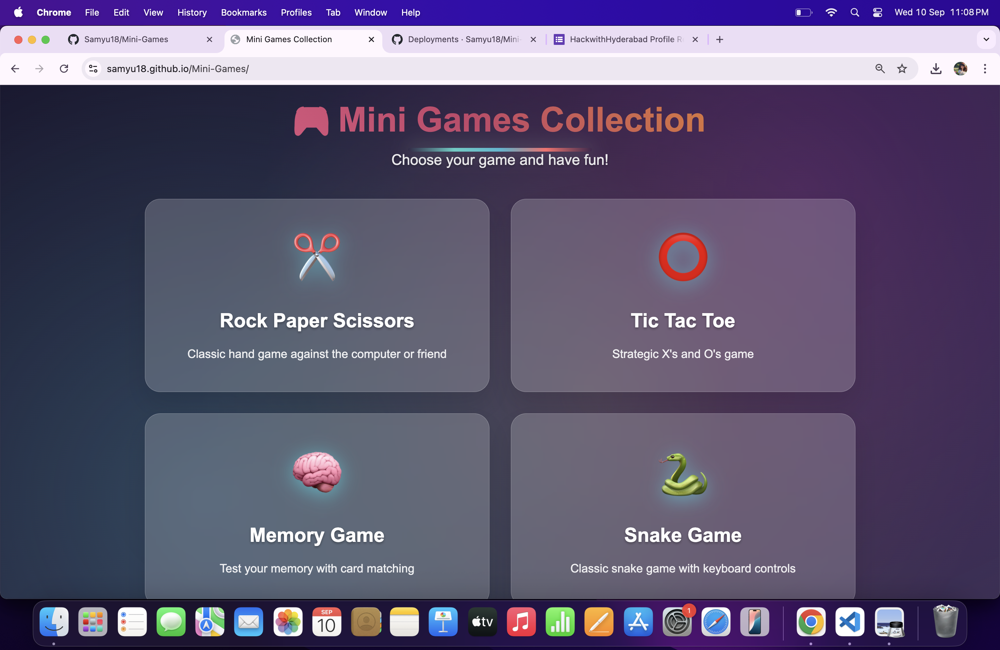
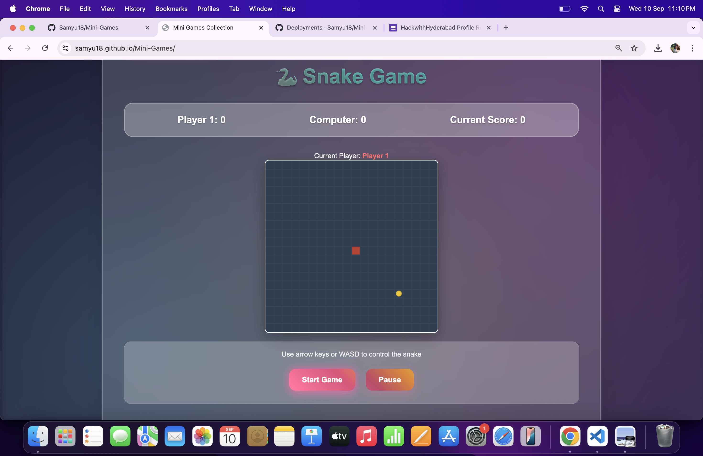
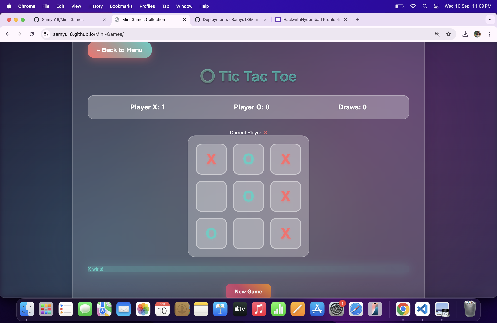
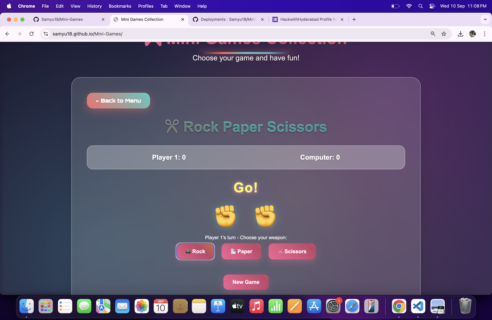
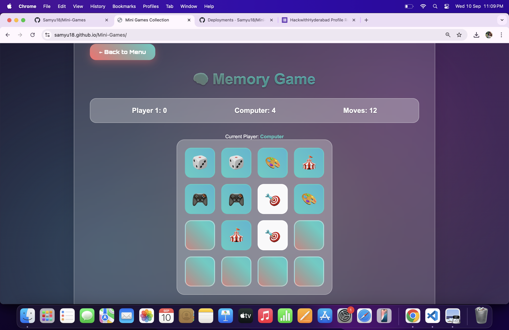

# Mini Games Collection

A beautiful, animated collection of browser mini-games (Rock Paper Scissors, Tic Tac Toe, Memory, Snake) – fully client-side, no backend required!

## Features
- 🎮 Four games: Rock Paper Scissors, Tic Tac Toe, Memory, Snake
- Play vs Computer or 2-Player mode for each game
- Modern, animated, visually appealing design
- Works 100% in the browser (no login, no backend, no database)

---

## Screenshots

### Home Page


### Snake Game


### Tic Tac Toe


### Rock Paper Scissors


### Memory Game


---

## Deploying to GitHub Pages

1. **Project Structure**
   ```
   your-repo/
     index.html
     static/
       css/
         styles.css
       js/
         script.js
       img/
         homepage.png
         snake.png
         tictactoe.png
         rsp.png
         memory.png
   ```

2. **Push to GitHub**
   - Commit and push all files to your repository.

3. **Enable GitHub Pages**
   - Go to your repo's **Settings > Pages**.
   - Set the source to the root (`/`) or `/docs` folder (wherever your `index.html` is).
   - Save.

4. **Visit Your Site**
   - Go to the URL shown in the Pages settings (usually `https://your-username.github.io/your-repo/`).
   - Enjoy your games!

---

## Notes
- All games run 100% in the browser. No backend, login, stats, or leaderboards.
- If you want to add more games, just update `index.html` and `static/js/script.js`.
- For a Flask or backend version, use a Python host (Render, Railway, Heroku, etc).

---

##